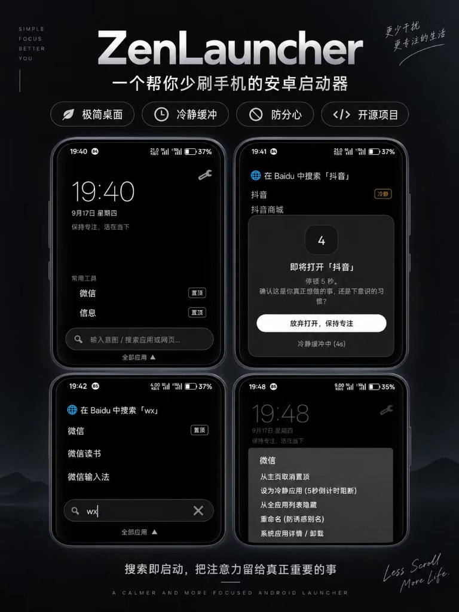

# ZenLauncher (原生 Android 极简防沉迷启动器)

> 基于 **100% 原生 Android (Kotlin + Jetpack)** 开发的超轻量级防沉迷桌面启动器。  
> 对标顶级开源极简启动器 **KISS Launcher** 与 **Olauncher**。  
> 宗旨：**消除视觉多巴胺刺激，打破肌肉记忆，以搜索与初衷为导向**。

<p align="center">
  
</p>

---

## 📥 最新版本下载

- **最新 Release 下载**：👉 [获取 ZenLauncher 最新 APK](https://github.com/GodHu777777/zenlauncher/releases/latest)
- **超轻量**：仅 **~4.6 MB**（极速瞬启，零后台常驻耗电）。
- **无缝升级**：已固化官方永久统一签名，每次版本升级均可**直接覆盖安装**，置顶与冷静应用配置永不丢失。
- **内置检查更新**：设置页内可一键检查 GitHub 最新发布并高速升级。

---

## ⚡ 为什么选择原生 Kotlin？

- **极致体积**：安装包仅 **~4.6 MB**（相较于跨平台框架缩小 90% 以上）。
- **零待机耗电**：使用系统原生 `TextClock` 与系统事件驱动，灭屏与空闲状态下 CPU 100% 深度休眠。
- **瞬时冷启动**：桌面冷启动耗时 **< 30 毫秒**，流畅跟手。
- **极佳的系统兼容性**：标准原生 `CATEGORY_HOME`，深度适配小米澎湃OS、华为鸿蒙、vivo、OPPO、三星等系统。

---

## ✨ 核心特性

1. **去多巴胺化纯文本主页 (Zero-Dopamine UI)**：
   - 彻底剔除所有彩色应用图标、未读红点通知与卡片，采用 OLED 纯黑高对比度排版。
   - 主页默认仅展示零功耗大数字时钟与 4~6 个纯文本日常工具（电话、浏览器、备忘录等）。
2. **意图直达搜索优先 (Intent-First Search)**：
   - 底部单手舒适区常驻意图搜索框，支持**中文全拼与首字母模糊匹配**（输入 `wx` 找微信，输入 `tb` 找淘宝）。
   - **网页直搜**：输入你想查的关键词后直接回车，即刻唤起默认浏览器搜索，彻底终结“找浏览器图标途中被社媒分心”的习惯。
3. **5 秒生理冷静倒计时阻断 (Mindful Friction)**：
   - 点击抖音、小红书、游戏等沉迷应用前，强制弹出 5 秒呼吸倒计时与反思提问：*“你打开手机的初衷是什么？这是真正想做的事还是下意识的习惯？”*
   - 提供最显著的「放弃打开，保持专注」按钮，有效打断冲动下意识的肌肉记忆。
4. **全应用抽屉与分类管理**：
   - 全部应用按拼音/字母严格 A ~ Z 升序排列。
   - 「管理冷静应用」弹窗内置即时搜索框，快速定位并勾选沉迷应用。
   - 支持从列表隐藏应用，以及自定义重命名（例如将抖音重命名为“消耗时间的短视频”）。
5. **全面支持应用双开 / 分身 (Dual Apps / Work Profile)**：
   - 深度适配国产 ROM 跨 Profile 机制（小米 HyperOS 999 空间、华为、OPPO、vivo、三星），完美识别微信分身、QQ分身。
   - 搜索拼音 `wx` 或首字母 `fs` 自动关联，自带原生 `[分身]` 徽章标记，支持分身独立置顶、独立防沉迷。
6. **极简纯文本日程待办 (支持 iCloud & CalDAV)**：
   - 主屏以纯文本优雅展示接下来的 1~3 条日程待办（如 `• 14:00 - 需求评审`），无日程时自动隐藏。
   - 配合开源 DAVx⁵ 或系统自带 CalDAV 账号一键秒级同步 iCloud，待机零额外耗电，绝不索取 Apple ID 密码。
7. **统一签名覆盖升级 & 配置备份恢复**：
   - 官方统一永久密钥签名，彻底告别“签名冲突”历史痛点，每次更新直接覆盖安装，所有配置 100% 完整保留。
   - 设置页内置「检查更新」一键直通 GitHub Release，并支持「配置备份与恢复」秒级导出与导入。

---

## 🛠️ 项目结构

```
zen_launcher/
├── .github/workflows/build-apk.yml   # 原生 Android Gradle 自动化打包
├── app/
│   ├── build.gradle                  # 模块构建与依赖 (Material3, TinyPinyin, Lifecycle)
│   └── src/main/
│       ├── AndroidManifest.xml       # 声明 CATEGORY_HOME 桌面属性与 QUERY_ALL_PACKAGES 权限
│       ├── res/                      # 极简 OLED 纯黑布局与样式资源
│       │   ├── layout/               # 主屏、设置、冷静弹窗、抽屉列表等 XML
│       │   └── values/               # 纯黑主题与调色盘
│       └── java/com/zenlauncher/app/
│           ├── MainActivity.kt       # 极简桌面主屏
│           ├── SettingsActivity.kt   # 设置中心与冷静应用管理
│           ├── manager/              # 应用包管理与偏好持久化
│           ├── model/                # 数据模型
│           ├── ui/                   # 纯文本列表适配器与倒计时弹窗
│           └── util/                 # TinyPinyin 模糊检索与网页直搜
├── build.gradle                      # 根 Gradle 配置
├── settings.gradle                   # 仓库与镜像源设置
└── README.md
```

---

## 📱 分支说明

- **`main`**：100% 原生 Android (Kotlin) 架构（推荐、轻量、省电）。
- **`deprecated-flutter`**：原 Flutter 架构归档分支。
