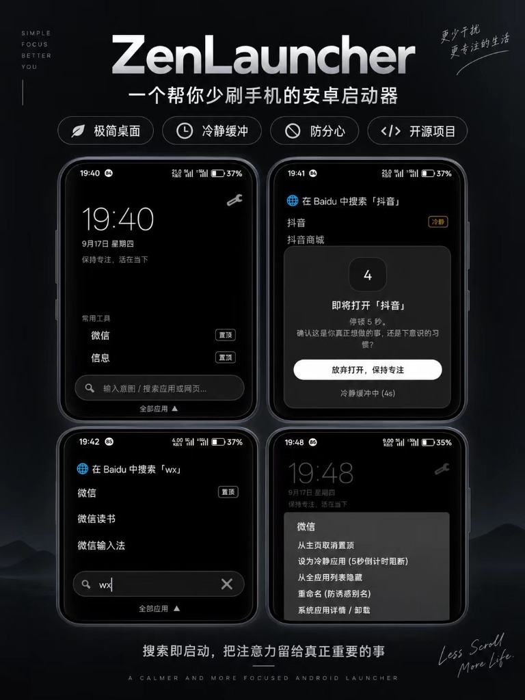

# ZenLauncher

基于 Kotlin + Android Jetpack 的纯文本极简桌面。通过搜索、常用应用和打开应用前的冷静倒计时，减少无意识使用手机。

<p align="center">
  
</p>

## 下载与升级

[下载最新发布的 APK](https://github.com/GodHu777777/zenlauncher/releases/latest)。支持 Android 7.0（API 24）及以上、允许安装 APK 的 Android 系统；最低 API 版本符合不等于所有设备均已验证。

Release 使用仓库中固定的 `app/zenlauncher.jks`，保持 V1 + V2 签名，便于覆盖此前同签名的官方版本。升级前可在设置中导出配置备份。设置页也提供 GitHub Release 更新检查；下载速度取决于网络。

## 默认桌面与返回行为

安装后，需要在 Android 的系统授权界面或默认应用设置中选择 ZenLauncher 为默认桌面。单纯点击应用图标进入 ZenLauncher，并不会自动改变 Home 键或回桌面手势的目标。

Android 10 及以上优先通过系统 HOME 角色请求；旧系统与不支持该请求的设备使用系统设置入口。用户可以拒绝授权，系统也可能收回角色，应用需要在返回时重新检查实际默认桌面状态。

v2.1.4 重点修复桌面导航：统一设置入口与授权返回后的状态核验，处理授权取消及设置回退，并通过 AndroidX 处理返回键与预测返回手势。桌面根页面的返回操作应留在 ZenLauncher；Home 操作的目标仍由系统选定的默认桌面决定。

小米/HyperOS、华为/EMUI、OPPO/ColorOS、vivo/OriginOS、三星/One UI 等系统可能对第三方桌面、全面屏手势、多用户或设备管理另有限制。系统设置入口是否可用、是否允许保留第三方桌面，由具体 ROM 和版本决定。应用内的设置引导及 ADB 辅助命令不能保证绕过厂商限制。这里的华为兼容范围仅指支持 Android APK 的系统，不包含 HarmonyOS NEXT 原生应用平台。

当前没有覆盖所有厂商真机的验证结果。复现记录、设备覆盖和回归步骤见 [桌面兼容性验证说明](docs/launcher-compatibility.md)。自动化测试只能证明其覆盖的应用行为，不能代替系统导航和厂商 ROM 实测。

## 功能

- OLED 纯黑纯文本主页、常用应用置顶、自定义座右铭。
- 中文全拼与首字母检索、网页搜索、应用抽屉、隐藏及重命名应用。
- 打开指定应用前的冷静倒计时，可单独管理冷静应用。
- 通过 Android LauncherApps / 用户配置文件 API 枚举与启动应用分身；部分厂商的私有分身空间可能不向第三方桌面开放。
- 读取系统 Calendar Provider 的近期日程；iCloud/CalDAV 需要由 DAVx⁵ 或其他同步工具写入系统日历。
- 配置导出/导入及 GitHub Release 更新检查。

## 构建与发布

需要 JDK 17、Android SDK 34 和 Build Tools 34.0.0：

```bash
./gradlew testDebugUnitTest lintDebug assembleRelease
```

版本唯一来源是 `app/build.gradle` 中的 `versionCode` 和 `versionName`。每次发布同时递增两者，无需修改 workflow 标签。签名必须保持现有 keystore、alias 和密码，不要生成新的签名替代它。

推送 `main` 或手动运行 workflow 时，CI 先执行单元回归、Android Lint、Release 构建及证书/V1/V2 签名检查。通过后保留构建产物，并为尚无版本标签的新版本创建 GitHub Release。已存在的版本标签保持不变；相同版本的新提交只提供 workflow artifact，应递增版本号后再正式发布。Pull Request 执行验证及构建，不创建 Release。

单元测试使用 Robolectric 模拟部分 Android 行为；它不运行厂商桌面、SystemUI 或真实键盘。实机验证按 [回归说明](docs/launcher-compatibility.md) 执行。

## 项目结构

```text
.github/workflows/build-apk.yml    # 测试、Lint、签名检查与版本发布
app/build.gradle                   # 版本、统一签名、构建与测试依赖
app/src/main/AndroidManifest.xml   # HOME/LAUNCHER、任务栈与返回配置
app/src/main/java/com/zenlauncher/app/
  MainActivity.kt                  # 主桌面与搜索、导航
  SettingsActivity.kt              # 设置、日历、更新、备份
  manager/                         # 应用、默认桌面、日历、配置、更新
  model/                           # 应用与日程模型
  ui/                              # 列表与冷静对话框
  util/                            # 拼音检索与网页搜索
app/src/test/                      # 单元及 Robolectric 回归测试
docs/launcher-compatibility.md     # 设备验证方法与边界
```

`main` 为当前原生 Kotlin 项目；`deprecated-flutter` 保留早期 Flutter 原型。
